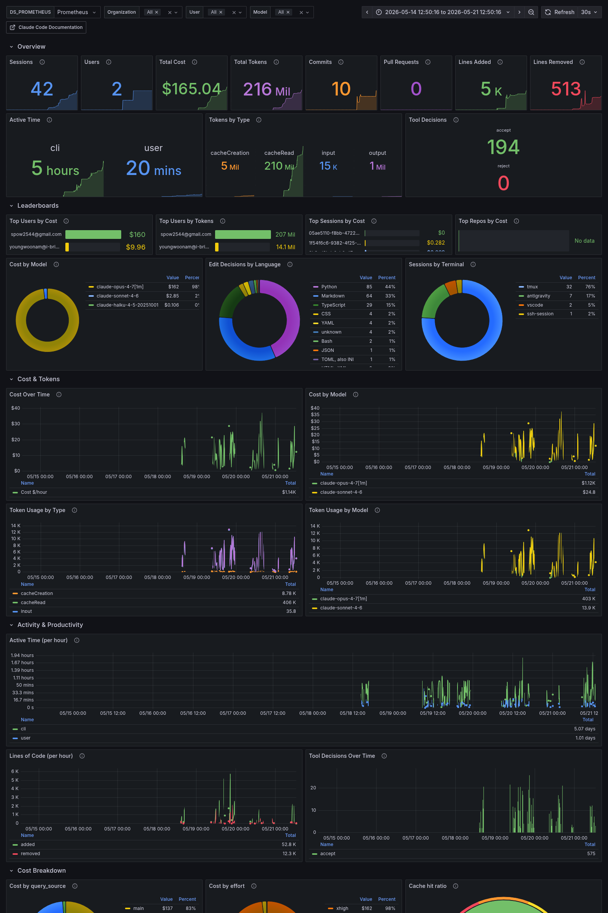
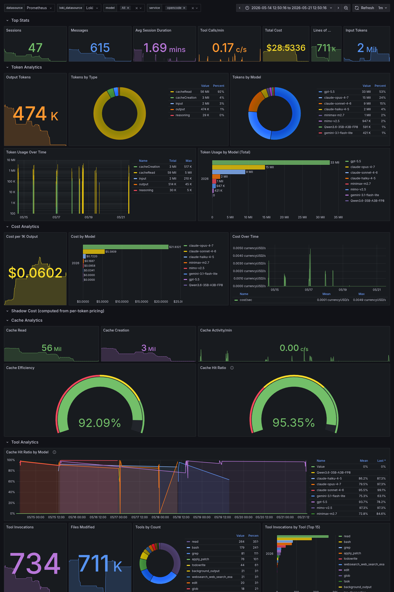
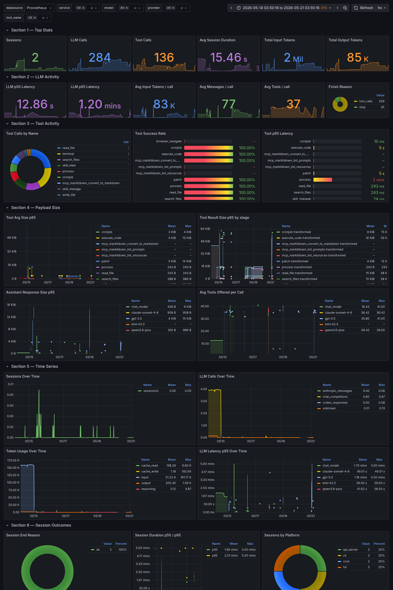
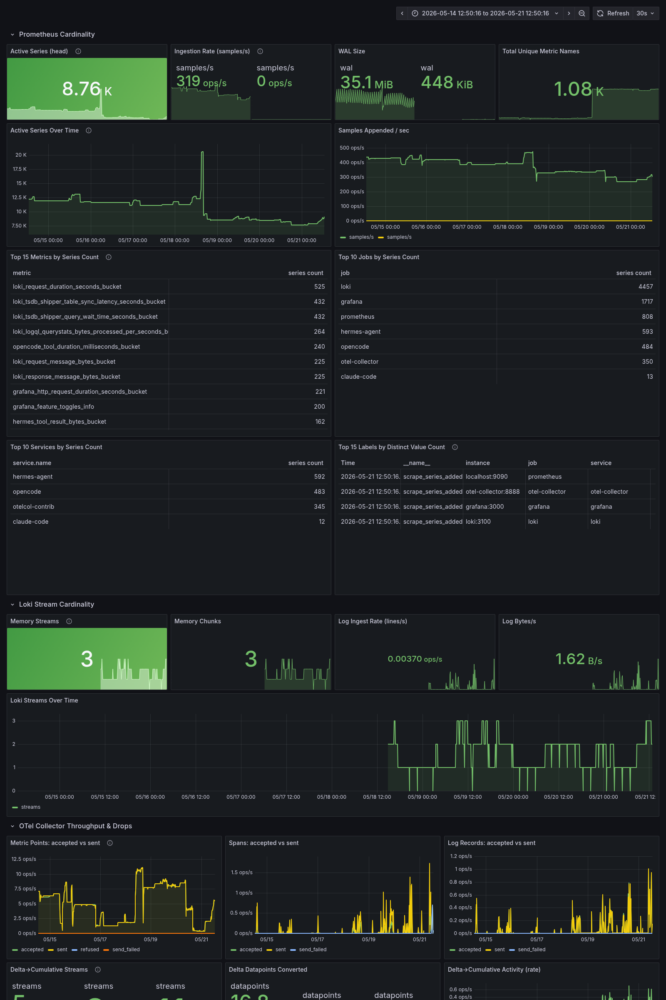

# observability

Self-hosted observability stack for local AI agents — **Claude Code**, **OpenCode**, and **Hermes**.
Captures token usage, dollar cost, session activity, tool decisions, commits, lines of code, and structured logs;
exposes everything through Grafana dashboards backed by Prometheus and Loki.

No external SaaS. No data leaves the host.

## Architecture

```
┌──────────────┐   OTLP HTTP
│ Claude Code  │ ──────────────┐
└──────────────┘  :4318        │
┌──────────────┐   OTLP HTTP   ▼
│   OpenCode   │ ──────►  ┌─────────────────────┐  remote_write   ┌──────────────┐
└──────────────┘  :4318   │  obs-otel-collector │ ─────────────►  │  Prometheus  │
┌──────────────┐          │   (deltatocumulative│                 │   :9090      │
│    Hermes    │ ──────►  │    + cardinality    │                 │   30d TSDB   │
└──────────────┘  :4317   │    + loki promote)  │                 └──────────────┘
                          └─────────┬───────────┘
                                    │ OTLP HTTP
                                    ▼
                          ┌──────────────┐
                          │     Loki     │
                          │   :3100      │
                          └──────────────┘

                          ┌──────────────────────────────────────────────────────┐
                          │  Grafana :3002  ←  provisioned dashboards & sources  │
                          │  Prometheus + Loki datasources, headless renderer    │
                          └──────────────────────────────────────────────────────┘
```

The OTLP receivers (`4317`/`4318`) and Grafana (`3002`) bind to `0.0.0.0`; everything else stays on `127.0.0.1`.
OTLP ingestion is gated by a **bearer token** (`OTEL_AUTH_TOKEN`) — see [docs/otel-setting.md](docs/otel-setting.md#authentication-required).

## Components

| Service | Image | Port | Role |
|---|---|---|---|
| `obs-otel-collector` | otel/opentelemetry-collector-contrib:0.116.1 | 4317/4318/13133/8888 | OTLP receiver, delta→cumulative, cardinality strip, fan-out |
| `obs-prometheus` | prom/prometheus:v3.0.1 | 9090 | Metric storage (30d retention) + remote_write receiver |
| `obs-loki` | grafana/loki:3.3.2 | 3110 | Log storage with `service_name` label promoted from OTel resource attrs |
| `obs-grafana` | grafana/grafana:11.4.0 | 3002 | Dashboards + datasources (provisioned from `grafana/provisioning`) |
| `obs-grafana-renderer` | grafana-image-renderer:3.12.4 | 8081 | Headless chromium for PNG/PDF export of dashboards |

## Quick start

```bash
cp .env.example .env
# set OTEL_AUTH_TOKEN in .env (generate one: openssl rand -hex 32)
docker compose up -d
open http://localhost:3002      # anonymous viewer enabled; admin/admin to edit
```

Then wire each agent (Claude Code / OpenCode / Hermes) to push OTLP at `<COLLECTOR_HOST>:4318`
with an `Authorization: Bearer <OTEL_AUTH_TOKEN>` header.
Full per-agent setup, verification, and troubleshooting lives in **[docs/otel-setting.md](docs/otel-setting.md)**.

TL;DR for Claude Code (use `127.0.0.1` for `<COLLECTOR_HOST>` if on the same machine):

```bash
export CLAUDE_CODE_ENABLE_TELEMETRY=1
export OTEL_METRICS_EXPORTER=otlp
export OTEL_LOGS_EXPORTER=otlp
export OTEL_EXPORTER_OTLP_PROTOCOL=http/protobuf
export OTEL_EXPORTER_OTLP_ENDPOINT=http://<COLLECTOR_HOST>:4318
export OTEL_EXPORTER_OTLP_HEADERS="Authorization=Bearer <OTEL_AUTH_TOKEN>"
```

## Dashboards

Provisioned under `grafana/provisioning/dashboards/`. Each dashboard auto-reloads every 30s when the JSON file changes on disk.

### Claude Code Metrics

Cost, tokens (incl. cache hit ratio), session count, commits, PRs, lines added/removed, tool decisions, leaderboards by user / session / repo, and time-series breakdowns by model, effort, and query source.



### OpenCode Metrics

Session activity, message volume, cost by model, token usage split (cacheRead / cacheCreation / input / output), tool invocation distribution, lines of code, retries, cache efficiency. Includes Loki-backed log panels.



### Hermes Agent Metrics

LLM call count, tool call count and success rate, input/output token volume, latency p50/p95 histograms, session and platform breakdowns, finish-reason distribution.



### Observability — Cardinality & Stack Health

Self-monitoring of the collector itself: accepted vs refused vs failed counters for spans / metric points / log records, per-exporter queue depth, per-metric series cardinality, and ingestion rates. Useful for catching the next time `deltatocumulative` starts dropping data or a label leak inflates a series count.



## Accurate metric queries

The agents in this stack emit **OTel cumulative counters with one series per session** (session_id is a resource attribute and gets preserved as a Prometheus label).
Combined with `deltatocumulative.max_stale: 5m` in the collector, naive `increase(metric[$__range])` queries massively over-count because reset extrapolation gets applied across every idle gap and every collector restart.

The dashboards in this repo use these patterns instead:

| Query goal | Use | Avoid |
|---|---|---|
| Total/breakdown over a window | `sum(last_over_time(M[$__range]) - min_over_time(M[$__range])) by (label)` | `sum(increase(M[$__range]))` |
| Distinct session count over a window | `count(count by (session_id) (max_over_time(M[$__range])))` | `sum(...)` on a per-session marker counter |
| Rate-style time series (trends) | `rate(M[$__rate_interval])` with `$__rate_interval` ≥ 2× push interval | short fixed windows that fall under one push |

The `last - min` form measures the actual cumulative growth that happened **inside** the window per series, then sums across all series. It is the only form that is stable against `deltatocumulative` resets and collector restarts.

`sum(increase(...[7d]))` was previously reporting **$285** for Claude Code over 7d; the corrected form reports **$167** — a ~40% over-count from reset extrapolation alone.

## Collector pipeline

```yaml
service:
  pipelines:
    metrics:
      receivers: [otlp]
      processors:
        - deltatocumulative                    # delta → cumulative; max_stale 1h
        - batch
        - resource                             # deployment.environment=local
        - transform/strip_metric_cardinality   # delete session_id, host_arch, os_type, ...
        - resource/strip_metric_cardinality    # same on resource-level keys
      exporters: [prometheusremotewrite]

    logs:
      receivers: [otlp]
      processors:
        - batch
        - resource
        - attributes/loki                      # promote service.name → Loki label
      exporters: [otlphttp/loki]
```

Traces pipeline is intentionally **not** wired. The collector still accepts OTLP traces at the receiver (so agents see no errors) but nothing is forwarded — there is no trace backend in this stack. Adding Grafana Tempo as a monolithic local-storage backend is the natural next step if span-level visibility becomes a need.

## Repo layout

```
.
├── docker-compose.yml
├── otel-collector-config.yaml
├── prometheus.yml
├── prometheus_rules.yml
├── loki-config.yaml
├── grafana/
│   └── provisioning/
│       ├── datasources/datasources.yaml
│       └── dashboards/
│           ├── claude-code-metric-ver2.json
│           ├── opencode-metrics.json
│           ├── hermes-metrics.json
│           ├── observability-cardinality.json
│           └── dashboards.yaml
└── images/                                # rendered dashboard previews
```

## Operational notes

- **Prometheus retention** is 30 days, but metric series identity is keyed on `session_id`, so abandoned sessions stop receiving samples after their TTL and effectively age out of `last_over_time` lookups well before retention.
- **Loki staleness**: container-side `service_name` label is promoted from the OTel `service.name` resource attribute via the `attributes/loki` processor. Use `{service_name="claude-code"} | session_id="..."` to drill from a metric panel into the exact session's logs.
- **Cardinality control**: high-churn labels (`host.arch`, `os.type`, `host.name`, `process.pid`, `app_version`) are stripped before `prometheusremotewrite`. `session_id` is intentionally kept at the **resource attribute** level (how Claude Code emits it), which survives `resource_to_telemetry_conversion` into Prometheus labels. It is stripped from **datapoint attributes** (how OpenCode emits it) to prevent per-series fanout from that path. This is what drives the special PromQL patterns described above.
- **Grafana renderer** is wired through `GF_RENDERING_SERVER_URL` so PDF/PNG dashboard exports work out of the box (used to generate the screenshots in this README).
